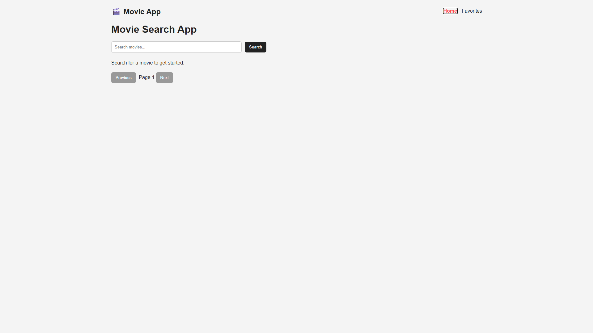

# 🎬 Movie App

A React movie search app built with the OMDb API.

---

## 🚀 Features

- 🔍 Search movies
- ⏱ Debounced search (better performance)
- 🎥 Movie details page
- ❤️ Add / remove favorites
- 💾 Favorites saved in localStorage
- 📄 Pagination (next / previous)
- 🔀 Multi-page navigation (React Router)

---

## 🛠 Built With

- React
- Vite
- JavaScript (ES6+)
- CSS
- OMDb API

---

## 📸 Screenshot



---

## ⚙️ Setup

```bash
git clone https://github.com/kkato0219/movie-app.git
cd movie-app
npm install
```

Create `.env` file:

```
VITE_OMDB_API_KEY=your_api_key_here
```

Run the app:

```bash
npm run dev
```

---

## 🌐 Live Demo

👉 (https://sage-empanada-9fe8ef.netlify.app/)

---

## 📚 What I Learned

- React component structure
- Custom hooks
- API fetching
- State management
- React Router
- LocalStorage
- Deployment (GitHub + Netlify)

---

## 👤 Author

Kenichi Kato